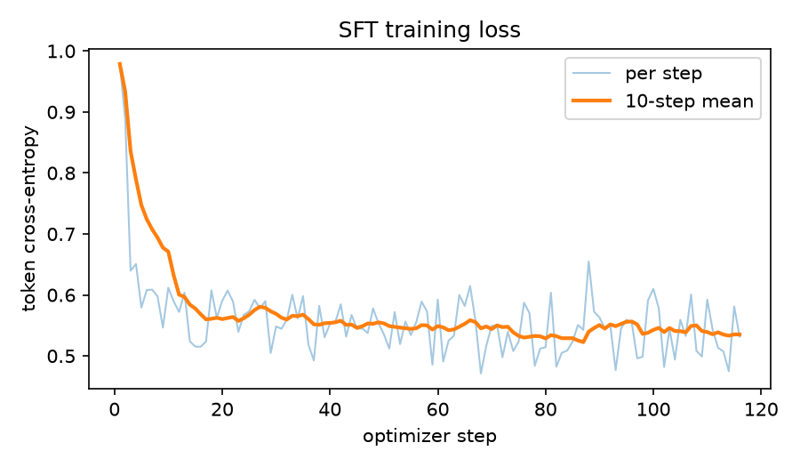
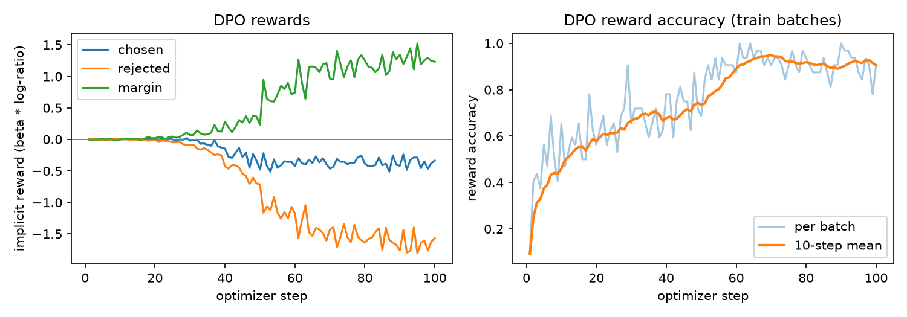
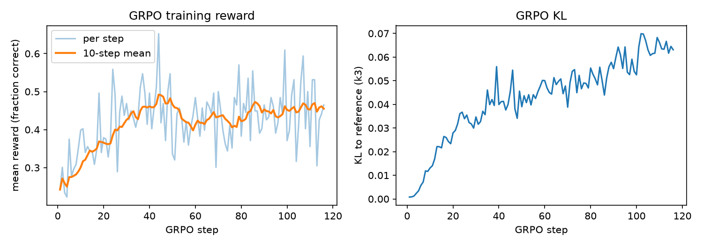

# LLM post-training on GSM8K: SFT, DPO and GRPO from scratch

Supervised fine-tuning, Direct Preference Optimization and Group Relative Policy Optimization
for grade-school maths word problems, written directly in PyTorch. The training loops, the three
losses, the learning-rate schedule, preference-pair construction, group advantages and the
pass@k evaluation are all in this repository (about 850 lines in `src/`). Hugging Face is used only
to load the model, tokenizer and dataset, and `generate()` for batched sampling.

Model: **Qwen2.5-0.5B** (base, 494,032,768 parameters, full fine-tuning, bf16 autocast with fp32
master weights). Data: **GSM8K** (`openai/gsm8k`, `main`, MIT licence): 7,473 training problems;
evaluation on the **full test set (1,319 problems)**, identical prompts and decoding for every model.

## Results

| Qwen2.5-0.5B | greedy pass@1 | pass@1 (T=0.7) | pass@4 | pass@8 | greedy answers with `####` | mean greedy tokens |
|---|---|---|---|---|---|---|
| base, zero-shot | 34.3 ¹ | – ¹ | – ¹ | – ¹ | 0.4 | 270 |
| base, 4-shot (reference only) | 35.0 | 26.5 | 51.1 | 63.5 | 94.1 | 104 |
| SFT | 34.6 | 27.2 | 51.9 | 64.3 | 97.3 | 94 |
| SFT → DPO | 29.2 | 21.5 | 43.6 | 56.4 | 82.9 | 158 |
| SFT → GRPO | **44.7** | **40.5** | **62.4** | **71.2** | 98.2 | 103 |

All numbers in %, on the 1,319 GSM8K test problems; pass@k from n = 8 samples per problem at
T = 0.7. One run per row; the standard error of a proportion near 35% with n = 1,319 is about
1.3 points.

¹ The first evaluation used an extractor that cut completions only at `Question:`. The base model
usually ends with `The answer is X.` followed by an invented `[Question] ...`, so the "last number"
came from the invented question and greedy pass@1 was logged as 5.5%. After the fix
(`src/data.py`), re-scoring the saved greedy completions gives 34.3%
(`src/rescore.py`, `results/rescored_greedy.csv`); greedy decoding is deterministic, so this equals a
re-run. The sampled completions were not saved, so the base model's pass@k is not reported. No other
model's outputs contain `[Question]`, so their numbers are unchanged.

What the numbers say:

* **SFT** teaches the output format, not more maths: zero-shot base, 4-shot base and SFT are all near
  35% greedy, but only SFT reliably writes `#### answer` and stops (97% vs 0.4% zero-shot).
* **GRPO** is the stage that improves reasoning accuracy: +10.1 points greedy and +13.3 points
  pass@1 over SFT after 30 minutes (116 steps, 3,712 training questions). The gain in pass@8 is
  smaller (+6.9), which fits the usual picture of RL with a verifiable reward sharpening the
  distribution towards answers the model could already sample.
* **DPO** on self-generated correct/incorrect pairs learned the preference (held-out reward
  accuracy 78.8%) but lowered greedy accuracy by 5.5 points. The implicit rewards of *both* chosen and
  rejected answers became negative (held-out means −0.59 and −1.19): the policy lowered the
  likelihood of its own good answers too, and its outputs became longer and less well-formed
  (mean greedy length 94 → 158 tokens; 17% of greedy answers have no final `#### x` line, against
  3% for SFT). This matches the known likelihood-displacement failure of DPO on reasoning pairs.

| | |
|---|---|
|  |  |
|  | |

Stage details (all measured, `results/*_summary.json`, `results/*_log.csv`):

* **SFT**: 1 epoch, 116 optimizer steps of 64 sequences (7,424 of the 7,473 problems; the last
  partial batch is dropped). Training loss 0.98 → 0.53.
* **DPO pairs**: 1,536 training questions × 8 samples at T = 0.8 from the SFT model; SFT sample
  accuracy 34.5%; 1,082 questions had both a correct and a wrong well-formed sample, giving 1,792
  pairs (1,613 train, 179 held out). 2 epochs, 100 steps of 32 pairs, β = 0.1, lr 2e-6.
  Training-batch reward accuracy: 0.46 over the first 10 steps, 0.91 over the last 10.
* **GRPO**: 116 steps × 32 questions × G = 8 = 29,696 sampled completions; 4 optimizer steps per
  sampled batch. Mean training reward 0.30 over the first 10 steps and 0.46 over the last 10
  (each step uses new questions, so the curve is noisy). 69% of groups had mixed rewards (non-zero
  advantages); KL to the SFT reference rose steadily, ending at 0.063; the clip was active on 0.45% of tokens on
  average.

Wall-clock on one node of a national HPC system with 2× NVIDIA A100 80GB PCIe
(each stage includes model loading):

| stage | GPU | wall-clock |
|---|---|---|
| eval, base zero-shot | 1 | 452 s |
| SFT training | 0 | 118 s (training loop 97 s) |
| eval, SFT | 0 | 450 s |
| DPO: pair sampling (12,288 completions) + training | 0 | 544 s (sampling 447 s, training 77 s) |
| eval, DPO | 0 | 441 s |
| GRPO training | 1 | 1,808 s |
| eval, GRPO | 1 | 432 s |
| eval, base 4-shot | 0 | 914 s |
| whole pipeline, both GPUs in parallel | 0 + 1 | 45 min 09 s |

With the zero-shot prompt, each evaluation is about 60 s of greedy decoding plus about 360 s for
the 10,552 sampled completions; autoregressive sampling, not the gradient steps, dominates the cost of every stage.

## Method

Prompt `Question: {question}\nAnswer:`; target ` {reasoning}\n#### {answer}<eos>`
(GSM8K calculator annotations `<<...>>` removed). The predicted answer is the last number in the
completion after truncating at the next invented question (`Question:` or `[Question]`) and after
the `#### x` line
(`src/data.py`).

### 1. SFT (`src/sft.py`, `losses.sft_loss`)

Next-token cross-entropy on answer tokens only; prompt and padding positions carry label -100:

$$\mathcal{L}_{\text{SFT}}(\theta) = -\frac{1}{N}\sum_{i}\sum_{t \in \text{answer}_i} \log \pi_\theta(x_{i,t} \mid x_{i,<t})$$

where N counts answer tokens in the whole gradient-accumulated batch (each micro-batch returns a
sum, normalised by the global token count). AdamW, linear warmup + cosine decay, gradient
clipping, bf16 autocast.

### 2. DPO (`src/dpo.py`, `losses.dpo_loss`)

Preference pairs come from the SFT model's own samples on training questions: for each question,
8 samples at T = 0.8; *chosen* = a well-formed sample with the correct final answer,
*rejected* = a well-formed sample with a wrong one (up to 2 pairs per question). The frozen
reference is the SFT model; since it equals the initial policy, its log-probs are computed once
before training.

$$\mathcal{L}_{\text{DPO}} = -\,\mathbb{E}\left[\log \sigma\!\left(\beta \log \frac{\pi_\theta(y_w\mid x)}{\pi_{\text{ref}}(y_w\mid x)} - \beta \log \frac{\pi_\theta(y_l\mid x)}{\pi_{\text{ref}}(y_l\mid x)}\right)\right], \quad \beta = 0.1$$

with sequence log-probs summed over completion tokens. Reported: reward accuracy
(fraction of pairs where the chosen implicit reward is higher) and the reward margin.

### 3. GRPO (`src/grpo.py`, `losses.grpo_loss`)

For each question, sample G = 8 completions from the current policy (T = 1.0); reward
r = 1 if the final answer is correct, else 0. Advantages are normalised within the group, so no
value network is needed:

$$A_i = \frac{r_i - \operatorname{mean}(r_1,\dots,r_G)}{\operatorname{std}(r_1,\dots,r_G) + \epsilon}$$

$$\mathcal{L}_{\text{GRPO}} = -\frac{1}{G}\sum_{i=1}^{G}\frac{1}{|y_i|}\sum_{t}\Big[\min\big(\rho_{i,t} A_i,\ \operatorname{clip}(\rho_{i,t}, 1-\varepsilon, 1+\varepsilon) A_i\big) - \beta_{\text{KL}}\, \hat{D}_{i,t}\Big]$$

with $\rho_{i,t} = \pi_\theta(y_{i,t}\mid\cdot)/\pi_{\text{old}}(y_{i,t}\mid\cdot)$,
$\hat{D}_{i,t} = e^{q-p} - (q-p) - 1$ (the k3 estimator of $\mathrm{KL}(\pi_\theta\,\|\,\pi_{\text{ref}})$, with $p, q$ the policy and
reference token log-probs), ε = 0.2, β_KL = 0.04, reference = SFT model. Each sampled batch
(32 questions × 8 = 256 completions) is split into 4 minibatches, one optimizer step each, so the
ratio and clipping are active after the first step.

### Evaluation (`src/evaluate.py`)

Greedy pass@1, and pass@k for k ∈ {1, 4, 8} from n = 8 samples at T = 0.7 with the unbiased
estimator $1 - \binom{n-c}{k}/\binom{n}{k}$ averaged over problems. Same prompt, max 300 new tokens,
seed and test set for every model. Batched generation with left padding and the KV cache.

## Layout

```
src/data.py       GSM8K loading, prompt format, answer extraction, pass@k
src/losses.py     SFT, DPO and GRPO objectives
src/common.py     model loading, token log-probs, batched generation, logging
src/sft.py        SFT training loop
src/dpo.py        on-policy pair construction + DPO training loop
src/grpo.py       GRPO sampling/update loop
src/evaluate.py   greedy pass@1 and sampled pass@k
src/report.py     summary table and plots from results/
src/rescore.py    re-score saved greedy completions with the current extractor
configs/          one YAML file per stage
slurm/            single-node, two-GPU pipeline script
tests/            answer extraction, pass@k, loss signs, masking, clipping
results/          metrics (JSON/CSV), greedy completions (JSONL), plots (PNG)
```

## Running

```bash
pip install --index-url https://download.pytorch.org/whl/cu124 torch==2.5.1
pip install -r requirements.txt
python -m pytest -q tests

python -m src.evaluate --config configs/eval.yaml --model Qwen/Qwen2.5-0.5B --name base
python -m src.sft  --config configs/sft.yaml  --model Qwen/Qwen2.5-0.5B --out ckpt/sft
python -m src.evaluate --config configs/eval.yaml --model ckpt/sft --name sft
python -m src.dpo  --config configs/dpo.yaml  --model ckpt/sft --out ckpt/dpo
python -m src.grpo --config configs/grpo.yaml --model ckpt/sft --out ckpt/grpo
python -m src.report results
```

Any config value can be overridden, e.g. `--set lr=5e-6 epochs=2`. On a Slurm cluster,
`slurm/pipeline.sbatch` runs everything on one node with two GPUs (fill in the partition and
account placeholders; set `WORK` to a directory holding the virtual environment and caches).

## Limitations

* One seed per stage and no hyperparameter search; each stage ran once with the configs in
  `configs/`. Differences under about 3 points are within noise.
* GRPO ran for a fixed 30-minute budget (116 steps); the training reward had flattened at about
  0.45 but was not run to convergence.
* The DPO result is for one setting (β = 0.1, lr 2e-6, 2 epochs, no NLL term). `src/dpo.py` has
  an optional NLL term on the chosen answers (`nll_weight`, the RPO-style fix for likelihood
  displacement); it is implemented but no result for it is reported here.
* Base-model pass@k is missing because of the extractor bug described under the table.
* The `lr` column of `results/*_log.csv` was rounded to six decimals by the logger and reads 0;
  fixed afterwards (`CsvLog` now keeps significant digits). The schedule itself is in
  `src/sft.py` (`warmup_cosine`).
* Sampling uses Hugging Face `generate`; a dedicated inference engine would make every stage
  several times faster, since sampling dominates the wall-clock.
* GSM8K only; no claim about other maths benchmarks or general ability.

## Licence

MIT (see `LICENSE`). GSM8K is released under the MIT licence; Qwen2.5-0.5B under Apache 2.0.
